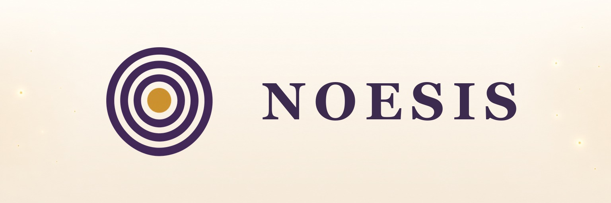
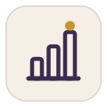
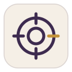

<div align="center">



# Noesis

**A free psychology plugin and psychology MCP server** for self-understanding and self-assessment — real, validated psychological/psychometric instruments, not a personality quiz.

### The more AI thinks for you, the easier it is to lose track of how you think. Noesis helps you find out — with real instruments, not a quiz.

[](https://noesis.seges.ai/info) [](https://github.com/seges-plugin/Psychology-Plugin) [](.claude-plugin/plugin.json) [](https://github.com/seges-plugin/Psychology-Plugin/stargazers) [](https://github.com/seges-plugin/Psychology-Plugin/network/members) [](LICENSE)

<p>
<a href="https://noesis.seges.ai"></a>
<a href="https://noesis.seges.ai/connect"></a>
<a href="#installation"></a>
<a href="#examples"></a>
<a href="#skills-8"></a>
<a href="#mcp-tool-surface"></a>
<a href="#authentication"></a>
</p>

</div>

<br/>

**Available as:** first and foremost, a free psychology **MCP server any LLM assistant can use** (MCP, short for Model Context Protocol, is the open standard AI assistants use to connect to outside tools) — reachable today from Claude, ChatGPT, Codex, Kimi Code CLI, or any other MCP-capable client. It's free; you sign in once at [noesis.seges.ai/connect](https://noesis.seges.ai/connect) to get a personal access token, and nothing is installed locally. For Claude Code users who want deeper integration, Noesis is also available as a **Claude Code plugin** — skills, agents, and hooks wrapping that same server, including `find_counselors` for anyone who wants a real, licensed counselor referral (see its own note below on current availability).

**16 validated public instruments · 8 skills · 4 agents · 37 MCP tools · 2 hooks**
*(26 from the noesis_mcp scoring package, plus 11 native account/consent/journal tools added 2026-08-06; see [MCP Tool Surface](#mcp-tool-surface).)*

> [!NOTE]
> **Free, always — no paid tier, no sponsorship program, no donation link.** Every real instrument, every skill, and the full MCP connector are free: one account, one personal access token, and — per [Authentication](#authentication) — no billing flow anywhere in this product. This plugin repo is also open source under the MIT license (see [License](#license)); the remote scoring server it connects to is separate, privately-operated infrastructure. The most useful way to support Noesis right now is to actually use it and open an issue when something's wrong.

## The problem

AI can now draft your emails, summarize your meetings, plan your day, and even guess how you probably feel about something — often before you've had a chance to think it through yourself. That's a genuine convenience. It's also a genuine risk: the small, repeated moments that used to force you to notice your own patterns — how you actually decide, what you actually value, where your attention actually goes — are quietly being handed to a system that never asks you to notice anything.

Meanwhile, the tools for building real self-understanding sit at two extremes:

- Online personality quizzes with no citations, no validation, and no real idea what they're measuring.
- Genuine, validated psychometric instruments — locked inside a clinician's office, gated behind cost, scheduling, and, for a lot of people, stigma.

Nobody occupies the middle: real instruments, available directly, explained in plain language without pathologizing anyone, with an honest safety net — and, for the person who actually needs a licensed human, a real way to find one.

## The solution

Noesis — νόησις, "pure intellectual cognition" — is an MCP-based self-understanding tool: a psychometric scoring engine we host and maintain, reachable from any MCP-capable AI assistant. For Claude Code users, it also ships as a plugin — skills, agents, and two hooks wrapping that same server. Nothing to install locally, no local server, and it's free — you just sign in once to get your connector token.

**Self-assessment, not self-diagnosis. Matching, not treatment.** Noesis scores what you actually answer, explains it honestly in plain language — and the moment something looks like it needs a real clinician, it routes you to one instead of pretending it can be one.

<div align="center">

</div>

<div align="center"></div>

Three properties make it a self-understanding, self-awareness tool, not a personality quiz *or* a therapist:

| | |
|---|---|
| **Validated** | Every instrument is real, published, and cited — or, where it's this product's own design (like the calibration exercise inside the financial-literacy battery), clearly labeled as exactly that. Never a disguised quiz. |
| **Strength-framed** | Every trait is interpreted as a capability first. The same data, read for what it enables, not what it's missing. |
| **Honestly bounded** | The system says outright what it can't do — diagnose, treat, remember you across sessions on its own — and hands off to a real, licensed counselor the moment that's what's actually needed. |

At its core, it's one remote MCP server — 37 tools reachable through the public connector (26 from the underlying `noesis_mcp` scoring package, plus 11 native account/consent/journal tools added 2026-08-06), 17 prompts. The Claude Code plugin wraps that same server with eight skills, four agents, and two hooks that check every message against a crisis rubric before anything else runs — one deeper-integration option among the MCP-capable clients that can reach it.

**Who it's for**: any adult who wants a clearer, more honest picture of how they think, decide, and relate — especially if you've noticed AI quietly doing more of that thinking for you lately. Welcoming to neurodivergent and twice-exceptional adults, without being only for them. Noesis is for adults 18 and older; signing up requires a self-attestation that you meet that age, since there's no independent age verification.

## How it works

**Any MCP-capable client (Claude Code, Claude.ai, Claude Desktop, ChatGPT, and others) → Noesis's psychology connector (`noesis-mcp`'s tools and prompts) → back to you — with Claude Code additionally able to layer this plugin's skills, agents, and hooks on top for a more guided flow.** This repo is a thin client: everything in it is plain text — skills, agents, hooks, and a `.mcp.json` pointer. None of the scoring logic, item banks, or counselor-lookup integration lives here.

A typical conversation flows like this:

1. **Pick an instrument.** `assessment-guide` walks you through the 16 real public instruments Noesis scores today, matched to what you actually want to understand.
2. **Answer with as little friction as possible.** Rather than interrogating you item by item, Noesis checks what it can already tell from the conversation (only with your consent, always disclosed afterward), and asks you directly about the rest.
3. **Get a read, not a report card.** `interpretation` turns raw scores into a plain-language narrative that leads with what each pattern enables. `coaching` picks up from there if you want to actually work with what you learned.
4. **Never lose the result.** `local-persistence` offers to save a completed result to a file you control, so a future session can pick up without you re-pasting anything.
5. **If it's ever more than self-understanding, it routes out — for real.** Every message is checked against a five-level crisis rubric before anything else happens. At Orange severity or above, Noesis stops coaching and connects you toward real crisis lines and, via `find_counselors`, an actual lookup of nearby licensed counseling and psychiatric providers. Noesis's job ends at the introduction — the counseling itself happens with them, not with Noesis.

<div align="center">

<br/><sub>Noesis's role ends at a real, human connection — not a replacement for one.</sub>
</div>

## What's inside

<details>
<summary><b>🧭 Self-Assessment Engine</b> — <code>assessment-guide</code> · <code>l00-context-delegate</code> · <code>local-persistence</code></summary>
<br/>

<table>
<tr>
<td width="72"></td>
<td>

16 free, real, cited public instruments — a Big Five quick screen, a Schwartz-style values questionnaire, CAT-Q, ASRS Part A, ECR-R, SWLS, IPIP-VIA-R Core Strengths, IPIP-NEO-120, a financial forecasting/calibration self-assessment, a wellness self-tracking battery, a Cross-Cultural Adaptability scale, a Research & Analysis Ability self-report, a Reasoning Style inventory (REI-40), a Self-Regulated Learning process scale, a Charisma/Self-Presentation self-assessment, and a Reasoning Ability performance test (graded multi-step arithmetic + structured logic). Complete one conversationally, or hand more of it to your AI assistant with `l00-context-delegate`'s slower, four-tier, review-before-submit protocol. A finished result saves to a file you control and picks back up later, or — for a connected user who explicitly consents — to your own Noesis account via the native `save_assessment_result` tool (added 2026-08-06).

</td>
</tr>
</table>

</details>

<details>
<summary><b>💬 Strength-Framed Interpretation & Coaching</b> — <code>interpretation</code> · <code>coaching</code></summary>
<br/>

<table>
<tr>
<td width="72"></td>
<td>

Every score comes back read for what it enables first, never what it lacks — a strength-based approach in which every population norm the underlying instrument actually has (or plainly doesn't) is disclosed rather than invented. `coaching` picks up from there with CBT/ACT/DBT-informed techniques, grounded in whatever you've assessed so far in the conversation.

</td>
</tr>
</table>

</details>

<details>
<summary><b>🛟 Crisis Safety Net</b> — <code>crisis-support</code> · 2 hooks</summary>
<br/>

<table>
<tr>
<td width="72"></td>
<td>

Every message is reasoned over against a five-level severity rubric (Green → Crimson) before anything else runs — no keyword scan, no fabricated classifier tool. At Orange or above, Noesis stops what it's doing, surfaces real crisis-line resources, and routes toward real outside help. Noesis doesn't treat a crisis; it makes sure one is never met with silence.

</td>
</tr>
</table>

</details>

<details>
<summary><b>🤝 Real Counselor Matching</b> — <code>find_counselors</code>, Noesis's counselor-search tool for finding a real counselor near you</summary>
<br/>

<table>
<tr>
<td width="72"></td>
<td>

The one tool that reaches outside Noesis entirely: a live Google Places lookup to find a real counselor near you — nearby, licensed counseling and psychiatric providers, with a rating correction and credential context for specialties with a verified registry. This is Noesis's actual answer to "I need real help" — a human, not a chatbot.


> [!NOTE]
> **Availability note (updated 2026-08-08).** `find_counselors` is live for every signed-in user — no Premium gate, no billing flow anywhere in this product (see the Free-always note above). Because it calls a real, paid external API (Google Places) on your behalf, it's limited to 20 searches/week and 40 searches/month per user; hitting the cap returns a clear in-band error explaining it, never a silent failure.

</td>
</tr>
</table>

</details>

## Installation

*How to connect Claude — or any other MCP-capable assistant — to this psychology tool: no local install, and Noesis is also listed as a Claude plugin marketplace entry for anyone who prefers that route.*

There are two ways in, and the first one is all most people need.

- **Any MCP-capable AI assistant.** Claude.ai, Claude Desktop, Claude Code, ChatGPT, Codex, Kimi, OpenClaw, and others. You add one connector URL and you have all 37 tools. Nothing is installed on your machine: no Python, no Node, no local server.
- **Claude Code, additionally.** Install this repo as a plugin and you also get the skills, agents, and hooks that wrap those same tools into a guided flow: the assessment protocol, strength-framed interpretation, and a crisis-safety hook that reads every message before anything else runs.

The account is free either way, and setup is about a minute.

### Requirements

- **To use the free MCP connector** (the option most people want): any MCP-capable AI assistant — Claude.ai, Claude Desktop, Claude Code, ChatGPT (Pro/Team/Enterprise/Edu), Codex, Kimi Code CLI, OpenClaw, or anything else that speaks Streamable HTTP MCP — plus a free Noesis account. Nothing local: no Python, no Node, no server to run.
- **To additionally install the Claude Code plugin**: Claude Code itself, and the `NOESIS_PAT` environment variable set in your shell *before* Claude Code starts.
- **To work on this repo itself**: nothing beyond a text editor and Git — there is no build step. See [Development & Contributing](#development--contributing).

### 1. Create your account and copy your token

Open **[noesis.seges.ai/connect](https://noesis.seges.ai/connect)**, sign in with Google or a phone number, confirm you're 18 or older via the required self-attestation checkbox, and agree to the terms. A personal access token is issued to you and shown **once**, so copy it before you leave that page.

Every tool call carries that token. It is what keeps the hosted endpoint from being abused, and it is what lets a result be saved to your own account when you ask for that. Signed in on the Noesis homepage, you can create, list, and revoke tokens whenever you want.

### 2. Add the connector

The connector URL, in full:

```
https://noesis.seges.ai/mcp
```

- Legacy SSE transport, if your client needs it: `https://noesis.seges.ai/sse`
- Live tool and prompt catalog, if you want to see what you are connecting to first: `https://noesis.seges.ai/info`

> [!WARNING]
> **Use that exact URL.** Noesis publishes its sign-in discovery only on this branded domain. A client pointed at the underlying Cloud Run hostname instead cannot complete a login: discovery returns a 404, the client quietly falls back to an unrelated service's sign-in, and you end up on a raw error page with nothing to act on. If a URL you were handed contains `run.app`, it is the wrong one.

| Your assistant | What to do |
|---|---|
| **Claude.ai / Claude Desktop** | Settings → Connectors → Add custom connector → paste the URL. Claude's connector supports the MCP sign-in flow, so it takes you through Noesis sign-in itself and you never paste a token by hand. |
| **Claude Code** (connector only, no plugin) | `claude mcp add --transport http noesis https://noesis.seges.ai/mcp --header "Authorization: Bearer <your-token>"`. You can also just ask Claude Code in chat to connect to it and let it register the connector for you. |
| **ChatGPT** (Pro, Team, Enterprise, or Edu) | Settings → Apps & Connectors → Developer Mode → add a connector with the URL above and an `Authorization: Bearer <your-token>` header. |
| **Codex, Kimi, OpenClaw, anything else** | Use that client's own "add a custom Streamable HTTP MCP server" flow with the same URL and the same header. The protocol is standard, so there is no Noesis-specific step beyond the URL and the token. |

That list is examples, not a whitelist. Clients differ in whether they support the automatic sign-in flow; where a client does not, the `Authorization: Bearer` header always works.

### 3. Claude Code only: add the plugin for the guided flow

Set your token **before** installing. Claude Code does not prompt for a missing environment variable; it just fails to connect, silently.

```bash
export NOESIS_PAT=<your-token>          # in your shell, before Claude Code starts
```

Then, in Claude Code — adding Noesis's Claude plugin marketplace entry for this psychology plugin:

```
/plugin marketplace add seges-plugin/Psychology-Plugin
/plugin install noesis@noesis
```

`.mcp.json` reads `NOESIS_PAT` from your environment and sends it as the `Authorization` header. Cloning this repo into your Claude Code plugins directory and restarting works too, with the same variable set the same way.

What the plugin adds on top of the connector: `assessment-guide`'s inference-and-disclosure protocol, `interpretation`'s strength-framed narrative, `coaching`, `local-persistence`'s save-and-resume convention, and the two hooks. Without it you still get all 37 real tools, just administered by your assistant's own judgment rather than these protocols.

### 4. Start a conversation

```
"I want to understand myself better. What should I take?"
"What do my Big Five results mean?"
"Help me work on procrastination."
"Save my results so I can pick this up later."
```

### If no Noesis tools appear

The usual cause is the token, and it fails quietly rather than loudly.

1. **Check the URL.** It must be `https://noesis.seges.ai/mcp` exactly. Anything containing `run.app` will not complete sign-in.
2. **Check that the token is actually reaching the connector.** For the plugin, `NOESIS_PAT` has to exist in the environment *before* Claude Code starts, so exporting it in an already-running session will not take effect until you restart. For a direct connector, confirm the `Authorization: Bearer` header is on the server entry.
3. **Confirm the token is still valid.** Sign in at [noesis.seges.ai](https://noesis.seges.ai), check your tokens, and issue a new one if you revoked or lost the old one. Tokens are shown once, so a token you did not copy is gone rather than recoverable.
4. **Check the server is up**, independently of your client: `https://noesis.seges.ai/info` returns the live tool and prompt catalog.

Until tools genuinely appear in your client, no scoring is possible. A good assistant will say so plainly rather than improvising a result, and this plugin's `SessionStart` hook instructs it to do exactly that.

*(Hostname history, for anyone holding an older link: the connector used to live at `connect.noesis.seges.ai`, and a 2026-07-30 edit briefly promoted an `mcp.noesis.seges.ai` domain that never resolved. Since 2026-08-03 the canonical URLs are the `noesis.seges.ai` paths above, with the site, MCP endpoint, and REST API sharing one branded domain behind a Cloudflare worker.)*

## Examples

Two real flows, exactly as they'd actually play out — one using nothing but the public MCP endpoint, one showing the plugin's own safety-net feature in action.

### Take a real instrument through nothing but the MCP connector

**Goal:** get an honest, validated read on your own personality patterns from any MCP-capable client — no plugin, no install, just the free connector token.

**User asks** (already connected to `https://noesis.seges.ai/mcp` in Claude, ChatGPT, or anything else that speaks MCP):
> "Give me the Big Five quick screen and score it for me."

**Response:** the model calls the `big_five_prompt` MCP prompt to pull the real 10-item wording (never inventing its own item text), asks the 10 items conversationally, then calls the `score_big_five` tool with the completed response set. It comes back with a plain-language read: per-trait scores, explicitly flagged as a quick IPIP-derived screen rather than the published TIPI, with an honest "population norms not available for this instrument" rather than a fabricated percentile.

**Under the hood:**
- One MCP *prompt* call (`big_five_prompt`) for real item text, one MCP *tool* call (`score_big_five`) for scoring — that's the entire request.
- The raw tool response is `scores` (0–100 per trait) plus `confidence`, `flags`, and `population_norms: "not available"` — everything the example above says out loud is just the calling model reasoning over that exact JSON, live, in the conversation.
- Nothing here needed the plugin. Add it (see [Installation](#installation)) and the same flow gets `assessment-guide`'s hybrid-inference protocol, chunked administration, and `interpretation`'s strength-framed narrative built in — this example is the floor, not the ceiling.

### Hand off to a real counselor when self-understanding isn't enough

**Goal:** the moment a conversation needs more than Noesis can honestly give it, get the person to an actual licensed human — not a chatbot pretending to be one.

**User says** (mid-conversation, after `crisis-support`'s safety-planning step, or any time):
> "I don't have a therapist right now. I think I need someone who does EMDR, and I'm in Portland, Oregon."

**Response:** Noesis calls `find_counselors(location="Portland, Oregon", focus="EMDR", max_results=5)` — the one tool in the entire system that makes a real outbound call. It comes back with nearby licensed providers, each carrying a `corrected_score` (an empirical-Bayes correction on the raw star rating, not the raw average itself) and, because "EMDR" matches a specialty this server actually verifies, a `regulatory_context` and `credential_check` for anyone claiming it. Noesis relays the tool's own `disclaimer` and `crisis_line_note` fields verbatim, and — if this came out of a crisis conversation — pairs the list with the crisis lines `crisis-support` already gave.

**Under the hood:**
- `find_counselors` is a live Google Places lookup — results can change between calls, unlike every other tool here, which is pure, deterministic computation on exactly what you sent it.
- The credential/regulatory layer only fires for specialties this server has a verified registry for (currently EMDR) — ask for something outside that list and you still get real providers, just without the extra credential check.
- Noesis's job ends at the introduction. The counseling itself happens with that provider, not with Noesis — see [Disclaimer](#disclaimer).

## Skills (8)

*Noesis's psychology skills for Claude Code — assessment, interpretation, coaching, crisis routing, and counselor search, all layered on top of the same free psychology MCP connector.*

| Skill | What it does | Try saying |
|---|---|---|
| `assessment-guide` | Guides instrument selection across all 16 real public instruments, infers what it reasonably can from context, retrieves real item text from the live MCP prompts, and scores the complete response set | "take an assessment", "what test should I take" |
| `l00-context-delegate` | A slower, higher-friction version of the same idea: builds a full response set from context you point it at (project files, earlier conversation), tiers every item's evidence on a fixed four-level scale, and shows you the whole table to approve before anything is scored | "fill this out based on what you know about me", "infer my answers from my files" |
| `interpretation` | Turns a scored result into a strength-framed, plain-language narrative — an archetype name, top patterns, and exactly what population norms do (and don't) exist for that instrument | "what do my results mean", "explain my profile" |
| `coaching` | Ongoing, evidence-based coaching (CBT/ACT/DBT-informed) grounded in whatever's been assessed so far in the conversation — a thinking partner, not a therapist | "help me with…", "what should I do about…" |
| `ema-review` | Says plainly that daily mood/check-in tracking isn't built yet instead of inventing trend data, and redirects to what Noesis can actually do | "how have I been doing", "review my check-ins" |
| `crisis-support` | Highest priority — overrides every other skill. Reasons over a 5-level severity rubric and, at Orange or above, stops other activity and routes toward real crisis lines and human help | "I'm in crisis", any indication of self-harm or danger |
| `local-persistence` | Offers to save a *completed* result to a local file you control (via Claude Code's own file tools) so a future session can pick up without re-pasting anything — nothing is stored on our servers | "save my results for later", "load my previous results" |
| `memory-distillation` | Paste-mode profile distillation: takes a block of text a *different* AI generated about you (Claude's memory, Kimi's memory export, ChatGPT's saved memory) and distills it into the same 9-dimension profile snapshot the in-conversation flow already builds — pasted content is treated strictly as data, never as instructions, and every dimension gets your explicit confirmation before `save_my_profile` is ever called. The deliberate, ongoing way outside-AI context reaches Noesis, not a stopgap | "here's what Claude remembers about me", "this is my ChatGPT memory" |

## Agents (4)

| Agent | Role |
|---|---|
| `assessment-proctor` | Administers an instrument step by step — pacing, chunking, breaks, accessibility accommodations |
| `results-interpreter` | Delivers a full strength-framed results narrative for anyone, adding 2e (twice-exceptional) context when it's relevant to the user — not assumed by default |
| `coaching-companion` | Ongoing coaching within the current conversation — no memory across separate conversations, and says so if asked |
| `safety-monitor` | Crisis detection and escalation toward real human and emergency resources |

## Hooks (2)

Both pure LLM reasoning — no shell command, no tool call:

| Event | What it does |
|---|---|
| `UserPromptSubmit` | Reasons over every message against the crisis-support severity rubric before anything else runs. At Orange severity or above, it injects a reminder that stops other activity and activates `crisis-support`. |
| `SessionStart` | Injects Noesis's standing behaviors — strength-framing, non-clinical, crisis-override, the real tool list — at the start of the conversation. |

There's no `PreToolUse`, `PostToolUse`, or any hook that runs a shell command.

## MCP Tool Surface

Noesis is a thin client: none of this logic lives in this repo. `noesis-mcp` — a separate, privately-operated server we run on Cloud Run — exposes the 26 tools in the table below over `.mcp.json`'s hosted URL; the connector in front of it (`service-system`) adds 11 more native tools on top, described in [Account, Consent, and Journal Tools](#account-consent-and-journal-tools-11-native-tools) below the table. There is no safety-classification tool and no tool to resume an assessment interrupted mid-administration — crisis judgment and per-session preferences (chunk size, language, accessibility) are always live reasoning, never read from a stored profile (see [Hooks](#hooks-2) and [Configuration](#configuration) below). It is **no longer true that there's no user-profile tool at all** — see the native tools section below for what changed 2026-08-06.

**Corrected 2026-07-30, recomputed 2026-08-06**: this plugin's connector reaches **26** tools from the base `noesis_mcp` server — stated as 24 on 2026-07-30, before 2 more (`get_verify_product_recommendations` and `check_cognitive_wellness_referral`, added 2026-08-01) were folded into this count. **New as of 2026-08-06**: the connector itself also now serves 11 native tools that are not part of the `noesis_mcp` package at all — real, DB-backed, and written directly into the connector for consent management, saving results, profile memory, and journaling. That makes **37** tools reachable through this plugin's actual connection (26 + 11). **Corrected 2026-08-06, later the same day**: this batch shipped with a 12th native tool, `grant_consent`, removed a few hours later on an explicit founder decision: consent-granting must be traceable to a real website session, not an MCP tool call with a much thinner audit trail. `get_consent_status` stays (read-only). Consent is now granted only at [noesis.seges.ai](https://noesis.seges.ai) -- see [Account, Consent, and Journal Tools](#account-consent-and-journal-tools-11-native-tools) below.

| Tool | Purpose |
|---|---|
| `score_big_five` | Score a 10-item Big Five quick-screen response set (not the published TIPI) — flat 0–100 scores per trait, confidence, flags, optional `provenance` |
| `score_pvq_rr` | Score a 22-item values-questionnaire response set (Schwartz's original 10-value theory, not the 2012 PVQ-RR) — higher-order categories, individual value scores, ranked priority list |
| `score_cat_q` | Score a 25-item CAT-Q (autistic camouflaging/masking) response set — Compensation, Masking, Assimilation subscales |
| `score_asrs_part_a` | Score a 6-item ASRS v1.1 Part A ADHD screener response set — a screener, not a diagnosis |
| `score_ecr_r` | Score a 36-item ECR-R adult-attachment response set (Anxiety, Avoidance dimensions); optional `reference_frame` for which relationship it's about |
| `score_swls` | Score a 5-item Satisfaction With Life Scale response set |
| `score_ipip_via_r` | Score an 18-item IPIP-VIA-R Core Strengths response set — 3 global dimensions, not VIA-Institute-affiliated, not the full 24-strength classification |
| `score_ipip_neo120` | Score a 120-item IPIP-NEO-120 facet-level Big Five response set |
| `score_financial_calibration` | Score a combined financial self-assessment — a real 3-item financial-literacy quiz plus a 7-item interval-estimation calibration exercise original to this server |
| `score_wellness_tracking` | Score combined wellness self-tracking — the real 8-item Epworth Sleepiness Scale plus a 12-item medication-adherence component — a personal tracking tool, not a diagnosis |
| `score_cross_cultural_adaptability` | Score a 16-item original Cross-Cultural Adaptability response set (Metacognitive, Cognitive, Motivational, Behavioral subscales) — inspired by, but not a reproduction of, the licensed Cultural Intelligence Scale; not independently validated |
| `score_research_analysis` | Score an 18-item Research & Analysis Ability response set (Source Verification, First-Principles Decomposition, Solution-Space Breadth) — an original composite, not a published or independently validated instrument |
| `score_reasoning_style` | Score a 40-item Rational-Experiential Inventory (REI-40) response set — a real, published self-report reasoning-style scale, not a graded logical-reasoning ability test |
| `score_self_regulated_learning` | Score a 16-item Self-Regulated Learning response set (Goal-Setting, Self-Monitoring, Strategy-Adjustment, Feedback-Seeking) — this module's own item set, distinct from `score_ipip_via_r`'s Mastery dimension, not independently validated |
| `score_charisma` | Score a 16-item Charisma / Self-Presentation response set — an original adaptation inspired by the General Charisma Inventory and the Warmth/Competence stereotype-content model; self-report text only, no image/photo input |
| `score_reasoning_ability` | Score a 19-item Reasoning Ability response set (14 GSM8K-style arithmetic word problems + 5 BIG-Bench-Hard-style structured-logic items) — a graded PERFORMANCE test scored by exact-match against a fixed answer key, complementary to (never merged with) `score_reasoning_style`'s self-report style scale. `responses` is a list of final-answer strings, not Likert integers. No matching MCP prompt — use `get_item_bank("reasoning_ability")` instead |
| `domain_filtered_report` | Filter a scored Big Five report to a specific life domain (clinical, workplace, education, relationships, creativity, leadership) |
| `battery_aggregate` | Aggregate multiple instrument results into one unified profile; warns instead of silently merging mismatched results |
| `battery_aggregate_json` | Same as above, accepting a JSON string |
| `check_instrument_consistency` | Checks a caller's assumed definition of an instrument against this server's own registered facts before mixing it into `battery_aggregate` |
| `describe_norm` | Describe a single trait/centile pair in plain language |
| `get_item_bank` | Item text and trait/facet mapping for any instrument — for the calling agent's reasoning only, never shown to the respondent |
| `list_instruments` | Structured catalog of every real instrument — name, tool, items, scale, time, licensing |
| `find_counselors` | The only tool that makes a real outbound call (Google Places) — looks up nearby licensed counseling/psychiatric providers, with a rating correction and, for verified specialties, credential context. Always returns a `disclaimer` and `crisis_line_note`. Available to every signed-in user, limited to 20 searches/week and 40 searches/month per user — see the note in [Real Counselor Matching](#-real-counselor-matching) above |
| `get_verify_product_recommendations` | Added 2026-08-01. Reads a `profile_summary` you already have (e.g. financial calibration, wellness tracking, self-regulated learning) and returns 0+ category-level "you might find X useful" suggestions — pure, local, read-only, never a named product, never an external call |
| `check_cognitive_wellness_referral` | Added 2026-08-01. Reads a `profile_summary`'s `reasoning_ability`/`ipip_neo120` entries and returns whether a cognitive-wellness referral suggestion applies — never claims to detect cognitive decline; a performance-snapshot/trait pointer, not a clinical determination |

### Account, Consent, and Journal Tools (11 native tools)

**Added 2026-08-06.** Not part of the `noesis_mcp` package above — these 11 are native to the connector
itself (`service-system`), backed by real per-user storage, and require the exact same personal access
token every `score_*` tool already needs. Full usage guidance — when to call what, and the
offer-consent-first discipline every one of them follows — lives in `skills/assessment-guide/SKILL.md`'s
own section on these tools; this is a summary, not the complete documentation.

**Corrected 2026-08-06, later the same day:** this batch originally shipped with a 12th tool,
`grant_consent`, pulled a few hours afterward on an explicit founder decision -- see the correction in
[MCP Tool Surface](#mcp-tool-surface) above for why. `get_consent_status` below is read-only and
unaffected; granting consent now happens only at [noesis.seges.ai](https://noesis.seges.ai).

| Tool | Purpose |
|---|---|
| `get_consent_status` | Read the caller's own current consent state |
| `save_assessment_result` | Persist an already-scored result to the user's own history (requires storage consent) |
| `list_my_assessments` | List the caller's own saved results, most recent first, optionally filtered by instrument |
| `save_my_profile` | Persist a distilled psychological-profile snapshot from conversation context — 9 free-text dimensions plus up to 5 verbatim quotes, append-only (requires its own consent) |
| `get_my_profile` | Read the caller's own most recent saved profile |
| `journal_write_entry` | Write a new journal entry — free text plus optional category tags (requires its own consent) |
| `journal_search` | Search the caller's own entries by keyword and/or category/date range |
| `journal_get_recent` | The caller's most recent entries, for resurfacing past context in a later session |
| `journal_view_memory` | The transparency view — consent state, latest profile, and recent journal entries in one call |
| `journal_grant_access` | Grant a specific agent/purpose access to a specific category of journal entries |
| `journal_revoke_access` | Revoke a previously-created access grant by its ID |

Each returns a plain `Error: ...` text message — never a protocol-level failure — when a consent gate
isn't satisfied, naming exactly what's missing. None of them should ever be called without the user's
explicit, informed agreement first; see `local-persistence`'s "always offer, never save silently" rule,
which these 11 follow too.

### MCP Prompts (17)

Real MCP prompts — not tools — that return the exact respondent-facing item text for each instrument, or (for the one general-purpose exception below) administration guidance, so skills never have to write their own item wording:

`big_five_prompt` · `pvq_rr_prompt` · `cat_q_prompt` · `asrs_part_a_prompt` · `ecr_r_prompt` · `swls_prompt` · `ipip_via_r_prompt` · `ipip_neo120_prompt` · `financial_calibration_prompt` · `wellness_tracking_prompt` · `cross_cultural_adaptability_prompt` · `research_analysis_prompt` · `reasoning_style_prompt` · `self_regulated_learning_prompt` · `charisma_prompt` · `profile_distillation_prompt` · `personalized_intake_prompt`

**Corrected 2026-08-06** (was 15): `profile_distillation_prompt` — the 9-dimension, up-to-5-verbatim-
quote shape the native `save_my_profile` tool persists (see [Account, Consent, and Journal
Tools](#account-consent-and-journal-tools-11-native-tools) above) — was already a real prompt on the base
server but had never been listed here. **Corrected again 2026-08-07** (16 -> 17): `personalized_intake_prompt`
was also already real and had also never been listed here -- unlike every other prompt above, it isn't
tied to one instrument; it takes an optional `pasted_context` argument and returns intake guidance for
administering any instrument to a user who has (optionally) shared background context about themselves.
See `skills/assessment-guide/SKILL.md`'s "Step -2" for when and how to use it. `score_reasoning_ability`
still deliberately has no matching prompt — use `get_item_bank("reasoning_ability")`'s own `text` field
instead.

## Authentication

*Is the Noesis MCP server safe to connect? Every tool call requires your own personal access token, tied to your free Google or phone sign-in rather than an open, anonymous endpoint, and you can create, list, or revoke that token from your account at any time.*

**What you need:** a free account and one personal access token. Open [noesis.seges.ai/connect](https://noesis.seges.ai/connect), sign in with Google or a phone number, agree to the terms, and a token is issued to you. It is shown exactly once, so copy it straight into your MCP client config as `Authorization: Bearer <token>` (or, for this plugin, into the `NOESIS_PAT` environment variable). Signed in on the Noesis homepage you can create, list, and revoke tokens at any time. There is no paid tier and no billing flow anywhere in this product.

**Why there's a token at all.** Until 2026-08-01 the endpoint was anonymous. That was reversed deliberately: a token makes the hosted endpoint abuse-resistant, and it gives a result somewhere to belong when you ask for it to be saved rather than kept only in the conversation.

**If your client speaks MCP sign-in, you can skip the copy-paste.** Since 2026-08-03 the connector publishes standards-based authorization-server discovery (RFC 9728 and RFC 8414) on `noesis.seges.ai`, so a client that supports the MCP OAuth flow, such as Claude.ai's connector, will discover Noesis's own sign-in and walk you through it directly. Two consequences worth knowing. First, client support varies, and the `Authorization: Bearer` header remains the universal fallback. Second, that discovery is published on the branded domain only, which is exactly why a connector pointed at the raw Cloud Run hostname cannot log in (see [Installation](#installation)).

**The separate gated connector, for the record.** A second, Google-OAuth-gated MCP server (`noesis_mcp_gated`) is built and unit-tested and, as last verified 2026-07-30, wraps all 27 real tools — that count predates the 2 tools added 2026-08-01 and hasn't been independently re-verified since (it lives in a separate repo this one doesn't have visibility into), so treat 27 as dated rather than current. It is **not live**, and it is a different thing from the discovery flow described above. As of 2026-07-29, Firebase's Google sign-in provider is enabled (verified live) but a dedicated Google OAuth 2.0 Web Client for that specific server, plus wiring its secrets into the deploy config, is still outstanding. Nothing in this README depends on it. When it ships, this section and `.mcp.json` will be the first things to change.

## Configuration

There's no per-user settings file. Chunk size, tone, and how much inference you want Noesis to do are choices made live in the conversation, every time — nothing is read from or written to a stored profile.

Results are the exception, and as of 2026-08-06 there are two ways to keep one, not one: `local-persistence`'s local file you control (write it with your assistant's own file tools, lives on your machine, not on our servers), or — if you're connected with a personal access token and explicitly consent — the native `save_assessment_result`/`list_my_assessments` tools, which persist to your own Noesis account instead. Neither is on by default; both require you to say yes each time your assistant offers.

## Reference material

### Coaching (2)

| Reference | Content |
|---|---|
| `coaching-protocols.md` | CBT/ACT/DBT-informed coaching techniques, adapted for neurodivergent adults among everyone else |
| `safety-guidelines.md` | Full 5-level crisis severity rubric, professional-referral guidance, ND-affirming therapy directories |

### Interpretation (10)

10 cover the original public instruments. The 6 public instruments added 2026-07-28/30
(Cross-Cultural Adaptability, Research & Analysis Ability, Reasoning Style, Self-Regulated Learning,
Charisma, Reasoning Ability) do **not** yet have a dedicated reference file — see
[MCP Tool Surface](#mcp-tool-surface) above.

| Reference | Content |
|---|---|
| `strength-frames.md` | Strength-framed descriptions for all 30 OCEAN facets |
| `ocean-facets.md` | Technical descriptions of all 30 OCEAN facets, high/low pole characteristics |
| `2e-archetypes.md` | Optional additional lens — common twice-exceptional profile patterns and archetype names, used when 2e context is relevant, not a standard reference applied to every result |
| `cat-q-interpretation.md` | Strength-framed, non-diagnostic interpretation of CAT-Q's three subscales |
| `asrs-interpretation.md` | Strength-framed, explicitly non-diagnostic interpretation of the ASRS Part A screener |
| `ecr-r-interpretation.md` | Strength-framed interpretation of ECR-R's Anxiety/Avoidance dimensions |
| `swls-interpretation.md` | Strength-framed interpretation of SWLS life-satisfaction bands |
| `ipip-via-r-interpretation.md` | Strength-framed interpretation of IPIP-VIA-R's three global dimensions |
| `financial-calibration-interpretation.md` | Strength-framed interpretation of the financial-calibration battery |
| `wellness-tracking-interpretation.md` | Strength-framed, non-diagnostic interpretation of the wellness-tracking battery |

## What This Solves

### For anyone using AI heavily and wanting to stay sharp

| Problem | Skill |
|---|---|
| "I want to actually understand myself, not just ask AI what to think" | `assessment-guide` |
| "What do my results actually mean?" | `interpretation` |
| "Help me work through procrastination / burnout / a decision" | `coaching` |

### For neurodivergent and twice-exceptional adults — among everyone else

| Problem | Skill |
|---|---|
| "I think I might be autistic, or have ADHD — what should I take?" | `assessment-guide` (CAT-Q, ASRS Part A) |
| "Explain my profile with twice-exceptional context" | `interpretation` |

### For returning users

| Problem | Skill |
|---|---|
| "Save my results for later" / "Load what I did last time" | `local-persistence` |
| "Score this from what you already know about me" | `l00-context-delegate` |

### For anyone who needs more than self-understanding

| Problem | Skill / Tool |
|---|---|
| "I'm in crisis" / "I need help now" | `crisis-support` (always active, highest priority) |
| "Find me a real counselor near me" | `find_counselors` (via `coaching` or `crisis-support`) |

## Development & Contributing

### Local development

There's no build step — skills, agents, and hooks are plain Markdown and JSON, so there's nothing to compile before you can read or edit them. Clone it, edit a `SKILL.md`/`hooks.json`/agent file directly, and reload the plugin in Claude Code to see the change. See [Requirements](#requirements) above for what you need before you can reach the live server this repo points at.

```bash
git clone https://github.com/seges-plugin/Psychology-Plugin.git
cd Psychology-Plugin
```

### Contributing guidelines

The clone above is all the setup there is. Please open an issue before a pull request for anything beyond a small, obvious fix: several of these files sit close to mental-health-adjacent content, and changes there deserve a second read before they ship.

## Credits & Acknowledgments

Every real instrument Noesis scores is either a published, cited measure or clearly labeled as this product's own original design — full citations and licensing per instrument live in `noesis-mcp`'s own documentation (a separate, private repo; see [MCP Tool Surface](#mcp-tool-surface) above for what's summarized here). In brief, the tools this plugin wraps build on:

- The **IPIP** (International Personality Item Pool) tradition — the Big Five quick screen, IPIP-VIA-R Core Strengths, and the full IPIP-NEO-120 all derive from IPIP's public-domain item pools.
- **Schwartz's original ten-value theory** of basic human values, behind the values-questionnaire tool.
- **CAT-Q** (the Compensatory Adaptive Camouflaging Questionnaire), for autistic masking/camouflaging.
- **ASRS v1.1 Part A**, the WHO/Kessler adult ADHD self-report screener.
- **ECR-R** (Experiences in Close Relationships – Revised), for adult attachment.
- **SWLS**, the Satisfaction With Life Scale.
- **REI-40**, the Rational-Experiential Inventory, for reasoning style.
- The **Epworth Sleepiness Scale** and the **ARMS** medication-adherence framework, inside the wellness-tracking battery.
- Lusardi & Mitchell's **"Big Three"** financial-literacy questions, inside the financial-calibration battery.
- The **General Charisma Inventory** and the **Warmth/Competence stereotype-content model**, as inspiration for the charisma/self-presentation tool.
- **GSM8K**-style arithmetic and **BIG-Bench-Hard**-style structured logic, as the format for the graded reasoning-ability performance test.
- **Google Places**, behind the real, live `find_counselors` lookup.

None of the organizations or authors above endorse Noesis or this integration — they're credited because their published instruments or frameworks are what this product actually scores or cites, not because of any affiliation. Where an instrument is this product's own original design instead (the calibration exercise inside financial-calibration, and the cross-cultural-adaptability/research-analysis/self-regulated-learning/charisma scales), the matching row in [MCP Tool Surface](#mcp-tool-surface) says so explicitly.

This repository itself has no package dependencies — skills, agents, and hooks are plain Markdown/JSON, and the only thing it talks to at runtime is the remote `noesis-mcp` server, reached over MCP per `.mcp.json`. See [License](#license) below for what this repo's MIT license does and doesn't cover.

## Disclaimer

Noesis is a self-understanding and self-assessment tool, not a clinical service. Nothing in this plugin diagnoses, treats, or provides therapy for any medical, psychological, or psychiatric condition, and using it does not create a therapist-patient, doctor-patient, or any other clinical relationship. Every instrument is either a real, cited, published measure or clearly labeled as this server's own original design — none has been independently reviewed by a psychometrician for this specific integration, and none carries neurodivergence-specific norms.

If you are in crisis or in danger, contact your local emergency number or a crisis line right now — see the resources in `crisis-support`. For ongoing support, `find_counselors` can help you find a real, licensed professional near you; Noesis's role ends at that introduction.

## License

[MIT](LICENSE) — this repo (skills, agents, hooks, and this documentation) only. The remote scoring engine (`noesis-mcp`) this plugin connects to is separate, privately-operated infrastructure; no part of its source ships here, and this license doesn't extend to it.
